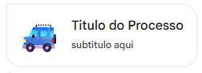
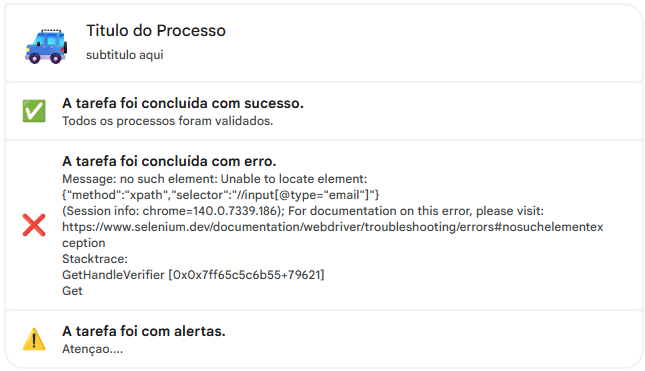
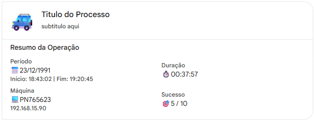
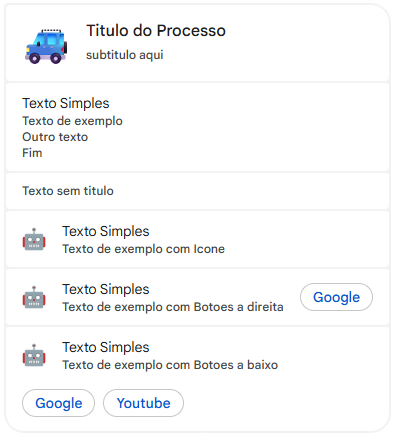
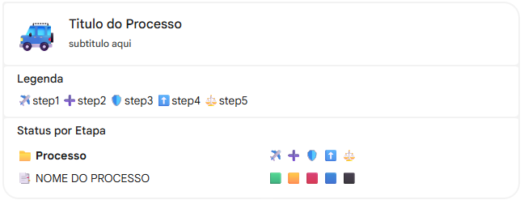
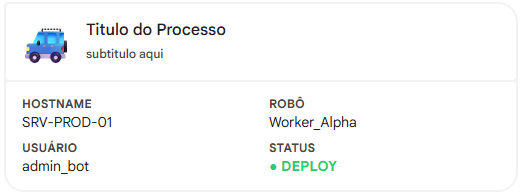

# gchatUts

Biblioteca python para envio de mensagens formatadas via webHook do google chat

## Contribua em
https://github.com/ZdekPyPi/GChat

## Uso

### Importando a Biblioteca

```python
from gchatUts import GChat
```

### Criando uma Instância

```python
from gchatUts import GChat,UiCard

g = GChat(webhook="SEU_WEB_HOOK")

#CRIA O CARD COM O TITULO E O ICONE APENAS
card = UiCard(
            title      = "Titulo do Processo",
            image_url  = "https://raw.githubusercontent.com/googlefonts/noto-emoji/main/png/128/emoji_u1f699.png", #ICONE TDO TITULO
        )

#ENVIA A MENSAGEM SO COM O TITULO
g.send_card(card)
```



### Envios Simples

```python
from gchatUts import GChat,UiCard
from gchatUts.sections import SectionSuccess,SectionWarn,SectionError

g = GChat(webhook="SEU_WEB_HOOK")

#SESSAO DE SUCESSO
successSection = SectionSuccess(
    title = "A tarefa foi concluída com sucesso.",
    text  = "Todos os processos foram validados."
)

#SESSAO DE ERRO
errorSection = SectionError(
    title = "A tarefa foi concluída com erro.",
    text  = '''Message: no such element: Unable to locate element: {"method":"xpath","selector":"//input[@type="email"]"}
  (Session info: chrome=140.0.7339.186); For documentation on this error, please visit: https://www.selenium.dev/documentation/webdriver/troubleshooting/errors#nosuchelementexception
Stacktrace:
	GetHandleVerifier [0x0x7ff65c5c6b55+79621]
	Get'''
)

#SESSAO WARN
warnSection = SectionWarn(
    title = "A tarefa foi com alertas.",
    text  = "Atençao...."
)
#CRIA O CARD COM O TITULO E O ICONE APENAS
card = UiCard(
            title     = "Titulo do Processo",
            image_url = "https://raw.githubusercontent.com/googlefonts/noto-emoji/main/png/128/emoji_u1f699.png", #ICONE TDO TITULO
            sections  = [successSection,errorSection,warnSection] #ADCIONA AS SECOES ABAIXO DO TITULO
        )

g.send_card(card)
```



## Criando Resumo RPA
``` python

from gchatUts.sections import *
from gchatUts.uikit import UiButton
from gchatUts import UiCard


#CRIA O RESUMO
sectionResumo = SectionResumo(
            data_start = "23/12/1991",   #DATA DE EXECUCAO
            hora_start = "18:43:02",     #HORA DE INICIO
            hora_end   = "19:20:45",     #HORA DE TERMINO
            duracao    = "00:37:57",     #TEMPO DE EXECUCAO
            target     = f"5 / 10",      #QUANTOS ITENS CONCLUIDOS
            maquina    = True
)

resume_card = UiCard(
            title     = "Titulo do Processo",
            subtitle  = "subtitulo aqui", 
            image_url = "https://raw.githubusercontent.com/googlefonts/noto-emoji/main/png/128/emoji_u1f699.png", #ICONE TDO TITULO
            sections  = [sectionResumo]
        )

g.send_card(resume_card)

```



## Exemplos de Texto
```python
from gchatUts import GChat,UiCard
from gchatUts.sections import SectionText

textSection = SectionText(
    title = "Texto Simples", #OPCIONAL
    text  = "Texto de exemplo\nOutro texto\nFim"
)
textSection2 = SectionText(
    text  = "Texto sem titulo"
)
textSection3 = SectionText(
    title    = "Texto Simples",              #OPCIONAL
    text     = "Texto de exemplo com Icone",
    icon_url = "https://raw.githubusercontent.com/googlefonts/noto-emoji/main/png/128/emoji_u1f916.png"
)

textSection4 = SectionText(
    title    = "Texto Simples",                                                                          #OPCIONAL
    text     = "Texto de exemplo com Botoes a direita",
    icon_url = "https://raw.githubusercontent.com/googlefonts/noto-emoji/main/png/128/emoji_u1f916.png",
    right_button = UiButton(text="Google",url="https://www.google.com")
)

textSection5 = SectionText(
    title    = "Texto Simples",                                                                          #OPCIONAL
    text     = "Texto de exemplo com Botoes a baixo",
    icon_url = "https://raw.githubusercontent.com/googlefonts/noto-emoji/main/png/128/emoji_u1f916.png",
    bottom_buttons= [
        UiButton(text="Google",url="https://www.google.com"),
        UiButton(text="Youtube",url="https://www.youtube.com"),
        ]
)

#CRIA O CARD COM O TITULO E O ICONE APENAS
text_card = UiCard(
            title     = "Titulo do Processo",
            subtitle  = "subtitulo aqui", 
            image_url = "https://raw.githubusercontent.com/googlefonts/noto-emoji/main/png/128/emoji_u1f699.png", #ICONE TDO TITULO
            sections=[textSection,textSection2,textSection3,textSection4,textSection5]
        )

g.send_card(text_card)

```



## Exemplo de ETAPA
```python
from gchatUts import GChat,UiCard
from gchatUts.sections import SectionEtapa

#CRIA O OBJETO DAS ETAPAS COM A COLUNA DE CADA ETAPA E ATRIBUI UM ID PARA CADA
sectionEtapa = SectionEtapa(
            [
                Etapa(titulo="step1",icone="✈️",id_etapa="1"),
                Etapa(titulo="step2",icone="➕",id_etapa="2"),
                Etapa(titulo="step3",icone="🛡️",id_etapa="3"),
                Etapa(titulo="step4",icone="⬆️",id_etapa="4"),
                Etapa(titulo="step5",icone="⚖️",id_etapa="5")
            ]
        )

#ADCIONA UM ITEM NA LISTA
sectionEtapa.add_job(
                descricao = "NOME DO PROCESSO",
                etapas = [
                    ItemEtapa(id_etapa='1',   status=ItemEtapa.STS_SUCC ), 
                    ItemEtapa(id_etapa='2',   status=ItemEtapa.STS_WARN),
                    ItemEtapa(id_etapa='3',  status=ItemEtapa.STS_DANG),
                    ItemEtapa(id_etapa='4', status=ItemEtapa.STS_BLUE),
                    ItemEtapa(id_etapa='5',   status=ItemEtapa.STS_BLCK) 
                    ]
                )

#CRIA O CARD COM O TITULO E O ICONE APENAS
etapa_card = UiCard(
            title     = "Titulo do Processo",
            subtitle  = "subtitulo aqui", 
            image_url = "https://raw.githubusercontent.com/googlefonts/noto-emoji/main/png/128/emoji_u1f699.png", #ICONE TDO TITULO
            sections=[sectionEtapa]
        )

g.send_card(etapa_card)

```



## Exemplo de card customizado

```python
from gchatUts.sections import UiSection
from gchatUts.uikit import UiColumns,UiDecoratedText


custom_sec = UiSection(
    widgets=[
        UiColumns(columns=[
            UiColumn(widgets=[
                UiDecoratedText(
                    top_label= "<b>HOSTNAME</b>",
                    text="SRV-PROD-01"
                ),
                UiDecoratedText(
                    top_label= "<b>USUÁRIO</b>",
                    text="admin_bot"
                )
            ]),
            UiColumn(widgets=[
                UiDecoratedText(
                    top_label= "<b>ROBÔ</b>",
                    text="Worker_Alpha"
                ),
                UiDecoratedText(
                    top_label= "<b>STATUS</b>",
                    text="<b><font color=\"#2ecc71\">● DEPLOY</font></b>"
                )
            ])
        ])
    ]
)

#CRIA O CARD COM O TITULO E O ICONE APENAS
custom_card = UiCard(
            title     = "Titulo do Processo",
            subtitle  = "subtitulo aqui", 
            image_url = "https://raw.githubusercontent.com/googlefonts/noto-emoji/main/png/128/emoji_u1f699.png", #ICONE TDO TITULO
            sections=[custom_sec]
        )

g.send_card(custom_card)


```

